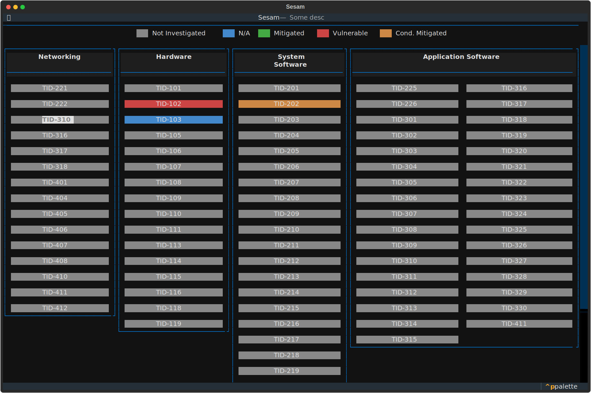
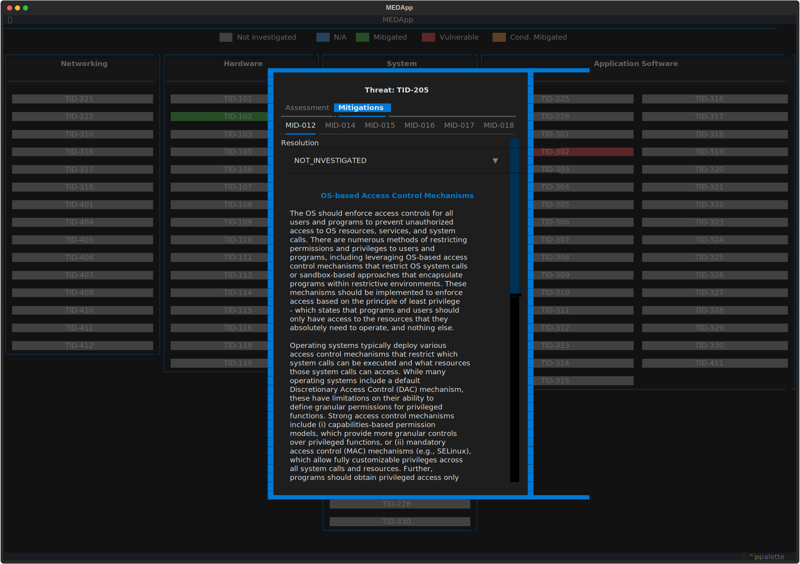

# MITRE EMB3D

A CLI, TUI & MCP Server for https://emb3d.mitre.org/

## Run

### Via `uvx`

```bash
uvx mitre-emb3d --help
```

or

```bash
uvx --from mitre-emb3d med --help
uvx --from mitre-emb3d med --pprint properties Networking --level 3
```

## Add to your project

The project can be used both as a tool & library

```bash
uv add mitre-emb3d
```

## Features

### 4 MITRE EMB3D Categories -

- Hardware
- System Software
- Application Software
- Networking

### What you can do (via library, CLI and MCP Server)

* List device properties for a given category
* List threats for a given category
* List threats for a given device property
* List device properties for a certain threat
* List mitigations for a given threat
* Get detailed information about a threat
* Get detailed information about a mitigation
* A CLI - AI Agent first (returns JSON output) / For humans add `--pprint` to see beautiful ouput
* A TUI - Heatmap creation, reading & update (See TUI section below for screenshots)
* An MCP Server
*
* ... more coming

## CLI Interface

Example -

```bash
$ uv run med --pprint list-threats-for-category "Networking"
- TID-221: Authentication Bypass By Message Replay
- TID-222: Critical System Service May Be Disabled
- TID-310: Remotely Accessible Unauthenticated Services
- TID-316: Incorrect Certificate Verification Allows Authentication Bypass
- TID-317: Predictable Cryptographic Key
- TID-318: Insecure Cryptographic Implementation
- TID-401: Undocumented Protocol Features
- TID-404: Remotely Triggerable Deadlock/DoS
- TID-405: Network Stack Resource Exhaustion
- TID-406: Unauthorized Messages or Connections
- TID-407: Missing Message Replay Protection
- TID-408: Unencrypted Sensitive Data Communication
- TID-410: Cryptographic Protocol Side Channel
- TID-411: Weak/Insecure Cryptographic Protocol
- TID-412: Network Routing Capability Abuse
```

> Note --pprint (default is OFF, default output is JSON) for display


***Explore other commands using the CLI help***

```markdown


 Usage: med [OPTIONS] COMMAND [ARGS]...

╭─ Options ────────────────────────────────────────────────────────────────────────────────────────────────────────────────────────────────────────────────────────────────╮
│ --release                                TEXT    2.0.1, 2.0 ... [default: 2.0.1]                                                                                         │
│ --heatmap-storage                        [json]  Storage type for heatmaps (e.g. json) [default: json]                                                                   │
│ --loglevel            -l                 TEXT    Set the logging level (debug, info, warning, error, critical) [default: warning]                                        │
│ --pprint                  --no-pprint            Whether to pretty-print the output (e.g. JSON lists) [default: no-pprint]                                               │
│ --install-completion                             Install completion for the current shell.                                                                               │
│ --show-completion                                Show completion for the current shell, to copy it or customize the installation.                                        │
│ --help                                           Show this message and exit.                                                                                             │
╰──────────────────────────────────────────────────────────────────────────────────────────────────────────────────────────────────────────────────────────────────────────╯
╭─ Commands ───────────────────────────────────────────────────────────────────────────────────────────────────────────────────────────────────────────────────────────────╮
│ list-categories               List the categories                                                                                                                        │
│ list-properties-for-category  List properties for a certain category                                                                                                     │
│ list-properties-for-threat    List properties for a certain threat                                                                                                       │
│ list-threats-for-category     List threats for a certain category                                                                                                        │
│ list-threats-for-property     List threats for a certain device property                                                                                                 │
│ list-mitigations              List mitigations for a certain threat                                                                                                      │
│ threat                        Threat Information                                                                                                                         │
│ mitigation                    Mitigation Information                                                                                                                     │
│ mcp                           Launch the MCP server                                                                                                                      │
│ heatmap                       HeatMap related commands                                                                                                                   │
╰──────────────────────────────────────────────────────────────────────────────────────────────────────────────────────────────────────────────────────────────────────────╯


```

## Heatmap TUI

You can use TUI to inspect & edit the Heatmap

```bash
# Make sure to initialize the heatmap
uvx mitre-emb3d heatmap init "MyProject" "Description of Project"
```

- Above command will create `myproject-heatmap.json` file in the local data directory
  * See https://specifications.freedesktop.org/basedir/latest/
  * e.g. on macOS & linux it will be in ~/.local/share/mitre-emb3d

- All the entries in the heatmap are set to NOT_INVESTIGATED


```bash
# Show the current state (and edit) using TUI
uvx mitre-emb3d heatmap tui MyProject
```

> You can override the default data directory by setting `MITRE_EMB3D_HEATMAP_JSON_STORAGE_DIR` environment variable




Clicking on Threat Entry will open a screen that presents a Form, Information about Threat & Mitigations



## MCP Server

> At the moment only STDIO is supported

For your `mcp.json` add the server like this

```json
{
  "servers": {
    "mitre-emb3d": {
      "command": "uvx",
      "args": ["mitre-emb3d", "mcp"]
    }
  }
}

```

Use mcp inspector to play with the MCP Server

```bash
npx -y @modelcontextprotocol/inspector uvx mitre-emb3d mcp
```
